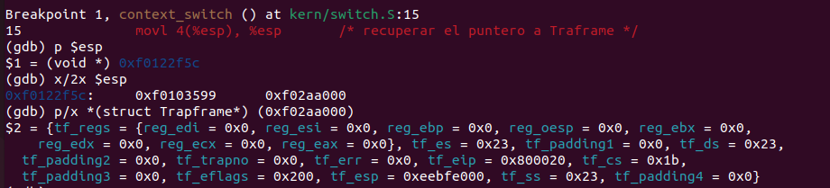
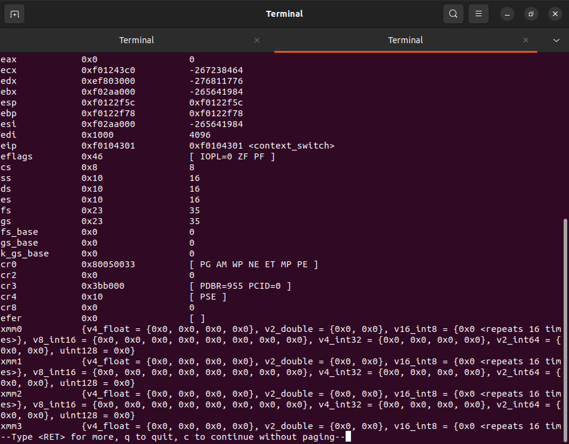
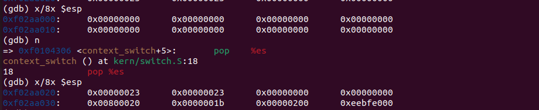
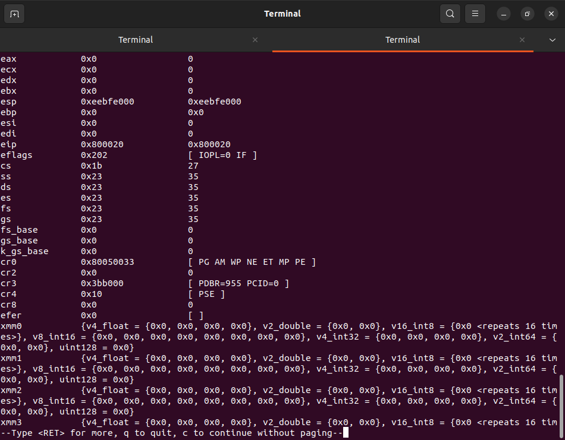
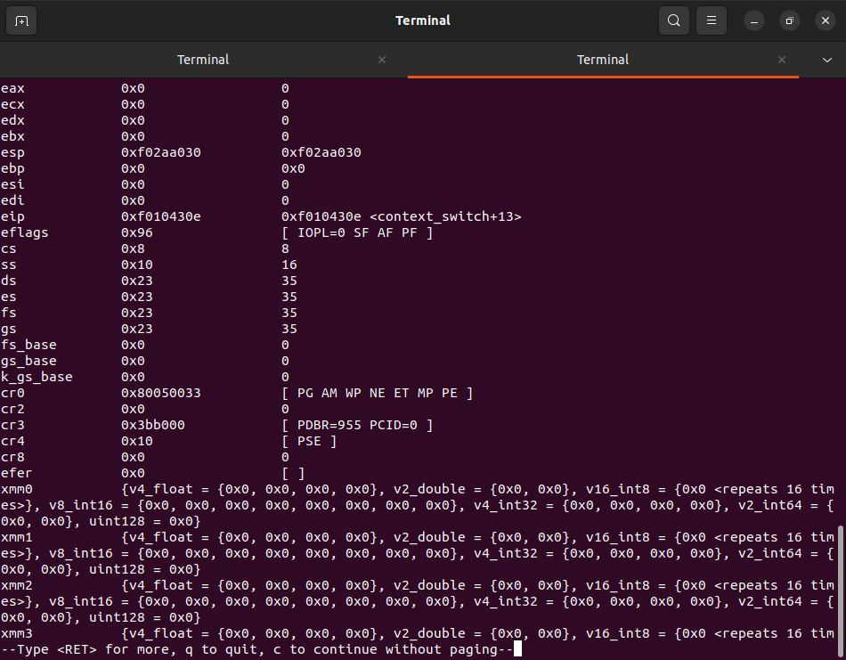
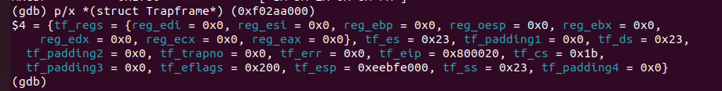

# sched

stack y trapframe al inicio de context_switch: 

registros al incio de context_switch: 

stack antes y depsues de popal: 

registros justo antes de iret: 

registros justo despues de iret: 

trapframe justo despues de iret:

## ROUND ROBIN

empieza por el proceso despues del cual la CPU estaba corriendo. A partir de ese busca el proximo proceso que este listo para correr. Recorre desde la posicion del proceso actual hasta el final de envs. Si lo encuentra llama a la funcion `env_runs` y se corre dicho proceso. Si no lo encuentra empieza a buscar desde el incio de envs hasta la poscion del env actual (circular fashion). Si no hay procesos listos para correr y el proceso actual se esta corriendo, se llama a env_run con ese mismo proceso para que se siga ejecutando. Todas las pruebas pasan haciendo `make grade`.

## SCHEDULER CON PRIORIDADES

Para el scheduler con prioridades decidimos hacer una implementacion del MLFQ scheduler donde cada proceso tiene asignada una prioridad que se va actualizando y se van alternando los procesos que se corren. Al incio en `env_create` se crean todos los procesos con prioridad 0 (la mejor prioridad). Alli se van a correr todos los procesos con un RR, y cada vez que se corra un proceso se va a disminuir su prioridad. Con esta implementacion todos los procesos se van a correr justamente (fairly). Para evitar el starve de algunos procesos el MLFQ actualiza las prioridades de todos los procesos a 0 cada S tiempo. Para simplificar esto, decidimos tener un contador de veces que se corren `env_run` llamado `time_counter_simplifier` que cuando llega a una cantidad deteremiada por 'TIME_SLICE_S_SIMPLIFIER' actualiza la prioridad de todos los procesos en envs. Con esta simplificacion del contador de tiempo, logramos hacer que se simule ese paso del tiempo de alguna manera mas facil de implementar. Igual que en RR, se hace circular fashion desde el proceso actual, buscando el primer proceso con menor prioridad para correrlo. Antes de correrlo, se le aumenta la priorida y se actualizan las estadisticas. Tambien decdimos que una cantidad apropiada de colas de prioridad nos parecia 8 
Las estadisticas que creimos mas importantes para mostrar fueron: la cantidad total de veces que se llamo a env_runs, la cantidad de veces que las prioridades fueron boosteadas a la mejor y la cantidad de veces que se llamo a sched_shield. Tambien decidimos mostrar todos los envs con su id y la cantidad de veces que fue corrido dicho proceso hasta terminar (.envs_run()).
Pasan todas la pruebas menos las de `primes`. Probamos cambairle la cantidad de colas y la constante `TIME_SLICE_S_SIMPLIFIER` pero la prueba falla por `primes: Timeout! FAIL (60.7s)`
Los procesos de usuario que se corren estan relacionados a la llamada a fork() y verificar las prioridades de los procesos que se crean. Pensamos que era la mejor forma de probar que un proceso hijo se este creando con la misma prioridad y una vez corrido se le baje la prioridad en uno a ese proceso.
